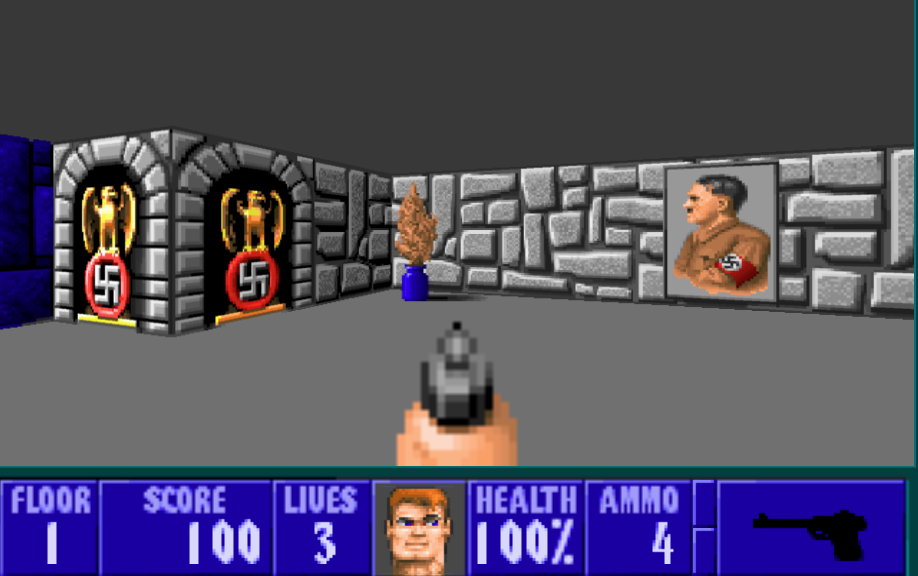

# Cub3d



---

## 🚀 Overview

Cub3d is a 42 school project where you build a basic 3D renderer using raycasting, similar to the technology behind early first-person games. The objective is to learn graphics programming, game mechanics, and collaborative development.

---

## 🎮 Controls

- **W / Up Arrow:** Move forward
- **S / Down Arrow:** Move backward
- **A:** Strafe left
- **D:** Strafe right
- **Q / Left Arrow:** Rotate camera left
- **E / Right Arrow:** Rotate camera right
- **I:** Toggle interface
- **O:** Toggle crosshair
- **L:** Toggle shadows
- **ESC:** Quit the game

---

## 🗺️ Features

- Textures/colors for walls (North, South, West, East) and sky/floor
- Shadows based on distance
- Crosshair display
- Three different sprite types (bonus)
- Minimap overlay (bonus)
- Collectable items (bonus)
- Raycasting for 3D rendering
- 2D debug map view (optional)
- Player collision detection
- Responsive player movement & camera rotation

---

## 📚 Resources

- [Lode's Computer Graphics Raycasting Tutorial](https://lodev.org/cgtutor/raycasting.html)
- [Permadi's Raycasting Tutorial](https://permadi.com/1996/05/ray-casting-tutorial-table-of-contents/)
- [Wolfenstein3D online](http://users.atw.hu/wolf3d)
- [MiniLibX documentation](https://harm-smits.github.io/42docs/libs/minilibx)

---

## 🏗️ Project Structure

```
cub3d/
├── assets/         # Images, diagrams
├── bin/            # Executable's location
├── build/          # Object files, libraries components.
├── includes/       # Header files
├── lib/            # Libraries (MiniLibX && Libft)
├── maps/           # Example maps
├── textures/       # Textures & sprites
├── src/            # Source code
├── main.c          # Entry point of the program.
├── Makefile
└── README.md
```
---

## ⚡ Build & Run Instructions

### Prerequisites
- GCC, Make
- MiniLibX (included in `lib/` or install via package manager)
- Linux (recommended) or macOS (with XQuartz)

### Build
```bash
make all
```

### Run
```bash
./bin/Cub3D [map_file]
```

---

## 👥 Team & Contribution

- **[Hodaifa Mouis](https://github.com/hmouis/)**
- **[BOUKIOUD Said](https://github.com/sboukiou/)**
